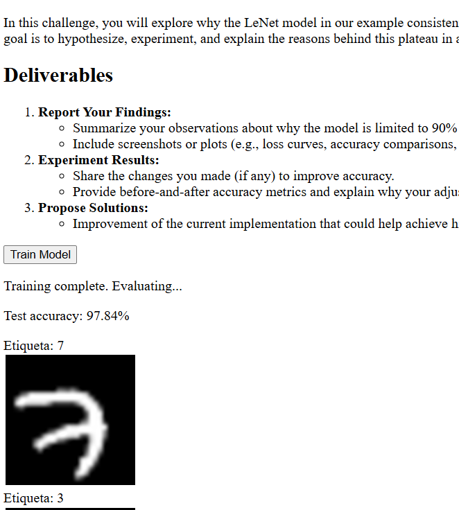
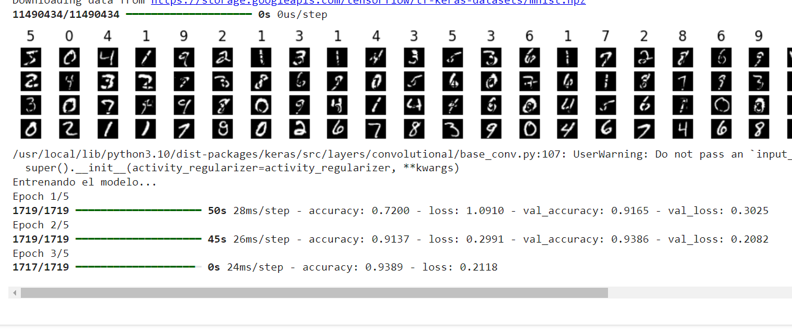
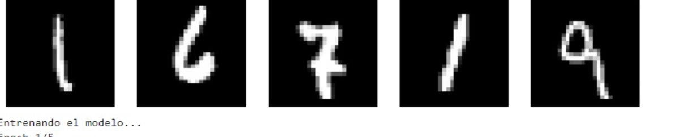
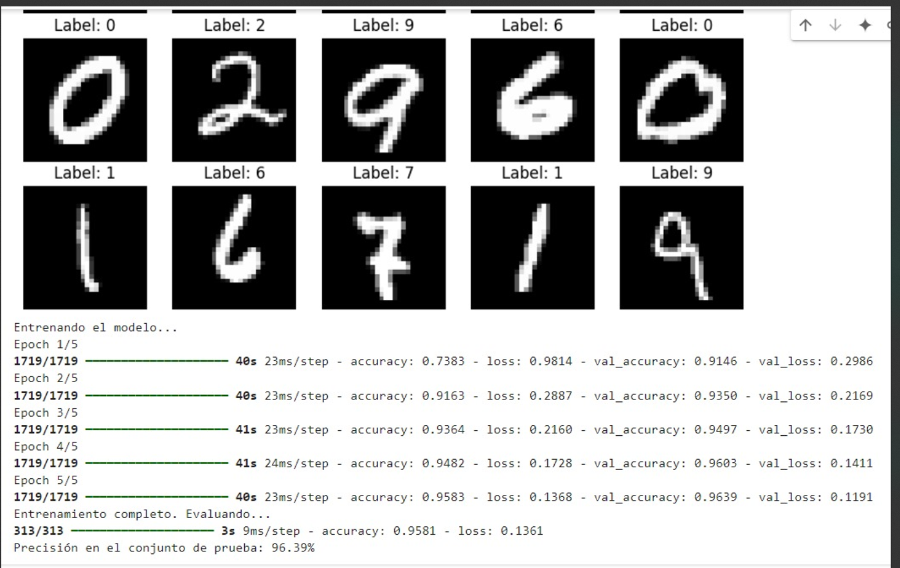
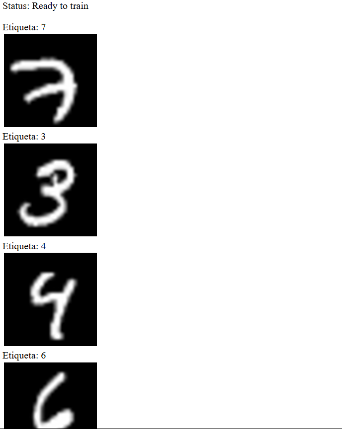

# Solución

Se logra solucionar el problema llegando a un accuracy de 99% con 30 épocas


| Época |  Accuracy |
|-------|----------|
| 5     |  96.47%   |
| 10     | 97.84% |
| 20     | 98.55% |
| 50     | ~99% |




Se detalla el proceso realizado a continuación:

## Pruebas realizando la revisión de los datos

Primero, se verifica la arquitectura de la red para establecer si esta esta teniendo influencia en el rendimiento del modelo. Durante el desarrollo de la clase, el énfasis estuvo en cambiar capas de la red neuronal, modificar pesos y demás, lo cual no dio resultado. Por ende, en esta etapa se opta por realizar pruebas y verificar los datos.

### Verificación de la arquitectura de la red

Para obtener una verificación de la arquitectura y validar que funciona correctamente se replicó el script enn python, con los mismos detalles de la red. Para este caso, al llamar los datos desde Kaggle, y aplicar la misma arquitectura de la red, se encontró una precisión superior al 90%, por tanto, se desarta que el problema sea la arquitectura de la red, toda vez que, se asume que deberia tener un rendimiento superior al 90%.

Se deja el código implementado en python

```
import tensorflow as tf
import numpy as np
import matplotlib.pyplot as plt

# Cargar y preprocesar el conjunto de datos MNIST

def load_mnist_data():
    # Cargar el conjunto de datos MNIST usando TensorFlow
    (train_images, train_labels), (test_images, test_labels) = tf.keras.datasets.mnist.load_data()

    # Seleccionar 55,000 imágenes de entrenamiento y 10,000 de prueba
    NUM_TRAIN_IMAGES = 55000
    NUM_TEST_IMAGES = 10000

    # Cortar los datos para obtener 55,000 imágenes de entrenamiento y 10,000 de prueba
    train_images = train_images[:NUM_TRAIN_IMAGES]
    train_labels = train_labels[:NUM_TRAIN_IMAGES]
    test_images = test_images[:NUM_TEST_IMAGES]
    test_labels = test_labels[:NUM_TEST_IMAGES]

    # Normalizar las imágenes a valores entre 0 y 1
    train_images = train_images / 255.0
    test_images = test_images / 255.0

    # Convertir las etiquetas a formato one-hot
    train_labels_one_hot = tf.keras.utils.to_categorical(train_labels, 10)
    test_labels_one_hot = tf.keras.utils.to_categorical(test_labels, 10)

    return (train_images, train_labels_one_hot), (test_images, test_labels_one_hot)

# Visualizar las primeras 1000 imágenes y sus etiquetas
def show_first_1000_images(train_images, train_labels, num_images=100):
    plt.figure(figsize=(15, 15))
    for i in range(num_images):
        plt.subplot(40, 25, i + 1)  # 40 filas, 25 columnas
        plt.imshow(train_images[i], cmap='gray')
        plt.title(np.argmax(train_labels[i]))  # Mostrar la etiqueta como el número predicho
        plt.axis('off')
    plt.show()

# Crear el modelo LeNet
def create_lenet_model():
    model = tf.keras.Sequential([
        # Primera capa convolucional
        tf.keras.layers.Conv2D(6, (5, 5), activation='tanh', padding='same', input_shape=(28, 28, 1)),
        tf.keras.layers.AvgPool2D(2, 2),

        # Segunda capa convolucional
        tf.keras.layers.Conv2D(16, (5, 5), activation='tanh'),
        tf.keras.layers.AvgPool2D(2, 2),

        # Capa de aplanado
        tf.keras.layers.Flatten(),

        # Capas densas
        tf.keras.layers.Dense(120, activation='tanh'),
        tf.keras.layers.Dense(84, activation='tanh'),
        tf.keras.layers.Dense(10, activation='softmax')
    ])
    return model

# Función para entrenar el modelo
def train_model():
    print('Cargando datos...')
    (train_images, train_labels), (test_images, test_labels) = load_mnist_data()

    # Visualizar las primeras 1000 imágenes
    show_first_1000_images(train_images, train_labels)

    # Crear y compilar el modelo
    model = create_lenet_model()
    model.compile(optimizer='sgd', loss='categorical_crossentropy', metrics=['accuracy'])

    # Entrenar el modelo
    print('Entrenando el modelo...')
    model.fit(train_images[..., np.newaxis], train_labels, epochs=5, validation_data=(test_images[..., np.newaxis], test_labels))

    # Evaluar el modelo
    print('Entrenamiento completo. Evaluando...')
    test_loss, test_acc = model.evaluate(test_images[..., np.newaxis], test_labels)
    print(f'Precisión en el conjunto de prueba: {test_acc * 100:.2f}%')

# Ejecutar la función de entrenamiento
train_model()

```

y los resultados obtenidos que muestran un rendimiento del modelo



Por tanto, se descarta la hipotesis de algún error en la red.

## Verificacion de las imagenes

Usando el mismo código de python, se realiza el ajuste para traer las imagenes desde los enlaces de google

```
MNIST_IMAGES_SPRITE_PATH = 'https://storage.googleapis.com/learnjs-data/model-builder/mnist_images.png'
MNIST_LABELS_PATH = 'https://storage.googleapis.com/learnjs-data/model-builder/mnist_labels_uint8'
```

al momento de correr el modelo se notan 2 cosas:

1- El proceso se estanca en el 90% de precisión


y 2- las imagenes que se obtienen no corresponden a lo que normalmente tiene el dataset MINST


por lo tanto, se infiere que hay algun proceso que no se esta teniendo en cuenta en el algoritmo para la obtención de las imagenes.


### Revisión de la imagen

La imagen que viene del enlace de google corresponde a una sola imagen, al verificar su tamaño se encuentra que tiene 65.000 pixeles de largo, por 784 pixeles de ancho. 

Recordando que cada imagen tiene 28x28 pixeles, lo cual da un total de 784 pixeles en total de la imagen, y que se estan pidiendo 65000 imagenes, se asume que la imagen se encuentra organizada con  **cada una de las imagenes del dataset MNIST en una sola fila**.

Por tanto, en el proceso de python se realiza un ajuste al código en python para cargar las imagenes, realizando un **reshape** de la imagen de 1x784 a 28x28, y al desplegar las imagenes, se ven los datos del dataset MNIST con los datos en el 



### Revisión de la carga de las etiquetas

No solo las imagenes debian ser formateadas antes de entrar al modelo, las etiquetas también. Se realizo una revisión de la literatura para encontrar como se organizaban estas etiquetas y se encontro que eran un array con 1 y 0, en donde el 1 representaba cual era la etiqueta, es decir, si se encontraba en la posición 7,  esa etiqueta corresponde al número 7, de la siguiente manera:

Etiqueta para el número 7
```
[0,0,0,0,0,0,0,1,0,0]
```

No obstante, las etiquetas se entregan en un arreglo de una sola dimensión, por lo que tiene esta forma

```
[0,0,0,0,0,0,0,1,0,0,0,0,0,0,0,0,0,1,0,0]
```

Lo cual evita que las etiquetas sean leidas correctamente. 


De esta manera, se agrupan las etiquetasen grupos de a 10 posiciones, se detecta a que clase pertenecen, y ahí si se pasan al modelo para su detección.



De esta manera, se lograque el modelo entrenado con las etiquetas super el 90% de precisión. A continuación se presenta el código

```
import numpy as np
import requests
from PIL import Image
from io import BytesIO
import tensorflow as tf
import matplotlib.pyplot as plt

# URL de los datos
MNIST_IMAGES_SPRITE_PATH = 'https://storage.googleapis.com/learnjs-data/model-builder/mnist_images.png'
MNIST_LABELS_PATH = 'https://storage.googleapis.com/learnjs-data/model-builder/mnist_labels_uint8'

# Cargar la imagen del sprite MNIST
def load_mnist_data():
    # Descargar la imagen de sprites MNIST
    response = requests.get(MNIST_IMAGES_SPRITE_PATH)
    img = Image.open(BytesIO(response.content))

    # Convertir la imagen a un array NumPy
    img_data = np.array(img)

    # Tamaño de las imágenes y número de clases
    IMAGE_SIZE = 28  # Cada imagen es de 28x28
    NUM_CLASSES = 10  # 10 clases (dígitos 0-9)
    NUM_TRAIN_IMAGES = 55000  # Número de imágenes de entrenamiento
    NUM_TEST_IMAGES = 10000  # Número de imágenes de prueba

    # Verificar las dimensiones de la imagen de sprite
    sprite_height, sprite_width = img_data.shape[:2]
    print(f"Dimensiones de la imagen de sprite: {sprite_height}x{sprite_width}")

    # Asegurarse de que la anchura sea de 784 píxeles (28x28)
    assert sprite_width == 784, "La anchura de la imagen debe ser 784 para imágenes de 28x28"

    NUM_IMAGES = sprite_height // IMAGE_SIZE 

    # Inicializar el array de imágenes
    dataset = np.zeros((NUM_IMAGES, IMAGE_SIZE, IMAGE_SIZE), dtype=np.float32)

    # Dividir la imagen en matrices de 28x28
    for i in range(NUM_IMAGES):
        # Extraer una fila de 784 píxeles (28x28)
        img_row = img_data[i, :]

        # Convertir la fila de 784 píxeles en una imagen de 28x28
        dataset[i] = img_row.reshape(IMAGE_SIZE, IMAGE_SIZE) / 255.0  # Normalizar

    # Descargar las etiquetas
    response_labels = requests.get(MNIST_LABELS_PATH)
    labels = np.frombuffer(response_labels.content, dtype=np.uint8)

    # Dividir las imágenes en entrenamiento y prueba
    train_images = dataset[:NUM_TRAIN_IMAGES]
    test_images = dataset[NUM_TRAIN_IMAGES:]

    train_labels = labels[:NUM_TRAIN_IMAGES]
    test_labels = labels[NUM_TRAIN_IMAGES:NUM_TRAIN_IMAGES + NUM_TEST_IMAGES]

    # Convertir las etiquetas a formato one-hot
    train_labels_one_hot = tf.keras.utils.to_categorical(train_labels, NUM_CLASSES)
    test_labels_one_hot = tf.keras.utils.to_categorical(test_labels, NUM_CLASSES)

    return (train_images, train_labels_one_hot), (test_images, test_labels_one_hot)


# Función para mostrar las primeras 25 imágenes de entrenamiento
def show_first_25_images(train_images, train_labels):
    plt.figure(figsize=(10, 10))
    for i in range(25):
        plt.subplot(5, 5, i + 1)
        plt.imshow(train_images[i], cmap='gray')
        plt.title(f"Label: {np.argmax(train_labels[i])}")
        plt.axis('off')
    plt.show()

# Crear el modelo LeNet
def create_lenet_model():
    model = tf.keras.Sequential([
        # Primera capa convolucional
        tf.keras.layers.Conv2D(6, (5, 5), activation='tanh', padding='same', input_shape=(28, 28, 1)),
        tf.keras.layers.AvgPool2D(2, 2),

        # Segunda capa convolucional
        tf.keras.layers.Conv2D(16, (5, 5), activation='tanh'),
        tf.keras.layers.AvgPool2D(2, 2),

        # Capa de aplanado
        tf.keras.layers.Flatten(),

        # Capas densas
        tf.keras.layers.Dense(120, activation='tanh'),
        tf.keras.layers.Dense(84, activation='tanh'),
        tf.keras.layers.Dense(10, activation='softmax')
    ])
    return model

# Función para entrenar el modelo
def train_model():
    print('Cargando datos...')
    (train_images, train_labels), (test_images, test_labels) = load_mnist_data()

    # Visualizar las primeras 25 imágenes
    show_first_25_images(train_images, train_labels)

    # Crear y compilar el modelo
    model = create_lenet_model()
    model.compile(optimizer='sgd', loss='categorical_crossentropy', metrics=['accuracy'])

    # Entrenar el modelo
    print('Entrenando el modelo...')
    model.fit(train_images[..., np.newaxis], train_labels, epochs=5, validation_data=(test_images[..., np.newaxis], test_labels))

    # Evaluar el modelo
    print('Entrenamiento completo. Evaluando...')
    test_loss, test_acc = model.evaluate(test_images[..., np.newaxis], test_labels)
    print(f'Precisión en el conjunto de prueba: {test_acc * 100:.2f}%')

# Ejecutar la función de entrenamiento
train_model()


```


## Una vez identificado el problema, y solucionado, volvemos a JavaScript

### Ajuste para cargar correctamente las imagenes
Con esto en mente, se abora el código de JS para realizar las modificaciones correspondientes.


Primero, se cambia la forma en como se realiza el seleccionado de las imagenes, la primera implementación compartida en clase extrae imagenes de 28X28 por toda la imagen

```
   for (let i = 0; i < NUM_TRAIN_IMAGES + NUM_TEST_IMAGES; i++) {
        const x = (i % 100) * IMAGE_SIZE;
        const y = Math.floor(i / 100) * IMAGE_SIZE;
        const imageData = ctx.getImageData(x, y, IMAGE_SIZE, IMAGE_SIZE);

        for (let j = 0; j < IMAGE_SIZE * IMAGE_SIZE; j++) {
          datasetBytesBuffer[i * IMAGE_SIZE * IMAGE_SIZE + j] = imageData.data[j * 4] / 255;
        }
      }

```

pero no es asi como esta organizada la imagen, por tanto, se realiza la modificación para obtener la imagen por cada fila de 784 pixeles, quedando el código de la siguiente manera

```
   for (let i = 0; i < NUM_TRAIN_IMAGES + NUM_TEST_IMAGES; i++) {
        const y = i; // Cada fila representa una imagen
        const imageData = ctx.getImageData(0, y, 784, 1); // Extraer toda la fila de 784 píxeles

        for (let j = 0; j < IMAGE_SIZE * IMAGE_SIZE; j++) {
            datasetBytesBuffer[i * IMAGE_SIZE * IMAGE_SIZE + j] = imageData.data[j * 4] / 255; // Normalizar
        }
    }
```
### Ajuste para cargar correctamente las etiquetas

De igual manera, siguiendo la lógica descrita de 1 etiqueta cada 10 posiciones, se realiza el siguiente ajuste en el código, adicionalmente se identifica que, como es una etiqueta por cada 10 posiciones del arary, debe realziarsen iteraciones de 550.000 datos para las 55.000 imagenes de entrenamiento y de 100.000 datos para las 10.000 de test


```
// Cargar las etiquetas
    const labelsResponse = await fetch(MNIST_LABELS_PATH);
    const labels = new Uint8Array(await labelsResponse.arrayBuffer());

    // Separamos las imágenes de entrenamiento y prueba
    const trainImages = datasetBytesBuffer.slice(0, NUM_TRAIN_IMAGES * IMAGE_SIZE * IMAGE_SIZE);
    const testImages = datasetBytesBuffer.slice(NUM_TRAIN_IMAGES * IMAGE_SIZE * IMAGE_SIZE);
    
    // Crear las etiquetas de entrenamiento agrupadas de 10 en 10
	// Crear las etiquetas de entrenamiento agrupadas de 10 en 10
	const trainLabels = [];

	for (let i = 0; i < NUM_TRAIN_IMAGES * 10; i += 10) { // Incrementar de 10 en 10
		trainLabels.push(labels.slice(i, i + 10)); // Extraer bloques de 10 y agregarlos como un nuevo array
	}

	// Crear las etiquetas de prueba agrupadas de 10 en 10
	const testLabels = [];

	for (let i = NUM_TRAIN_IMAGES * 10; i < (NUM_TRAIN_IMAGES + NUM_TEST_IMAGES) * 10; i += 10) { // Incrementar de 10 en 10
		testLabels.push(labels.slice(i, i + 10)); // Extraer bloques de 10 y agregarlos como un nuevo array
	}

    // Crear tensores para las imágenes
    const trainX = tf.tensor4d(trainImages, [NUM_TRAIN_IMAGES, IMAGE_SIZE, IMAGE_SIZE, 1]);
    const testX = tf.tensor4d(testImages, [NUM_TEST_IMAGES, IMAGE_SIZE, IMAGE_SIZE, 1]);


	// Convertir etiquetas one-hot a índices
	function convertToNumericLabels(labels) {
		return labels.map(oneHotArray => oneHotArray.findIndex(value => value === 1));
	}

	// Convertir etiquetas de entrenamiento y prueba a índices
	const trainNumericLabels = convertToNumericLabels(trainLabels);
	const testNumericLabels = convertToNumericLabels(testLabels);

	// Crear tensores para las etiquetas (one-hot encoding)
	const trainY = tf.oneHot(tf.tensor1d(trainNumericLabels, 'int32'), NUM_CLASSES);
	const testY = tf.oneHot(tf.tensor1d(testNumericLabels, 'int32'), NUM_CLASSES);

	console.log("Train Y:", trainY);
	console.log("Test Y:", testY);

    // Crear tensores para las etiquetas (one-hot encoding)
    //const trainY = tf.oneHot(tf.tensor1d(trainLabels, 'int32'), NUM_CLASSES);
    //const testY = tf.oneHot(tf.tensor1d(testLabels, 'int32'), NUM_CLASSES);

    return {
        trainX,
        trainY,
        testX,
        testY
    };
}

```

con estos ajustes a la función `loadMnistData()` se puede realizar correctamente la carga de las imagenes

Adicionalmente, se creo una función para mostrar las primeras imagenes

```

function showFirst25Images(trainX, trainY) {
    const container = document.getElementById('images-container');
    container.innerHTML = ''; // Limpiamos el contenedor antes de añadir nuevas imágenes
    container.style.width = "250px";

    // Convertir el tensor a un arreglo para acceder a los valores
    const imagesArray = trainX.arraySync(); // Convierte el tensor a un arreglo
    const labelsArray = trainY.arraySync(); // Convierte el tensor de etiquetas a un arreglo

    for (let i = 0; i < 25; i++) {
        const imgData = imagesArray[i]; // Obtener la imagen i (28x28)
        const labelData = labelsArray[i]; // Obtener la etiqueta i
		
        const canvas = document.createElement('canvas');
        const ctx = canvas.getContext('2d');
        canvas.width = 28;
        canvas.height = 28;

        const imageData = ctx.createImageData(28, 28);

        for (let row = 0; row < 28; row++) {
            for (let col = 0; col < 28; col++) {
                const value = Math.floor(imgData[row][col] * 255); // Acceder a cada valor en imgData
                imageData.data[(row * 28 + col) * 4] = value;       // Rojo
                imageData.data[(row * 28 + col) * 4 + 1] = value;   // Verde
                imageData.data[(row * 28 + col) * 4 + 2] = value;   // Azul
                imageData.data[(row * 28 + col) * 4 + 3] = 255;      // Alfa (totalmente opaco)
            }
        }
        
        ctx.putImageData(imageData, 0, 0);
		
		
		        // Crear un elemento para mostrar la etiqueta
        const labelElement = document.createElement('div');
        labelElement.textContent = `Etiqueta: ${labelData.indexOf(1)}`; // Suponiendo que es one-hot encoding

        container.appendChild(labelElement); // Añadir la etiqueta al contenedor
		

        const imgSrc = canvas.toDataURL();
        const imgElement = document.createElement('img');
        imgElement.src = imgSrc;
        imgElement.alt = `Image ${i + 1}`;
        imgElement.style.width = '150px';
        imgElement.style.height = '150px';
        imgElement.style.margin = '2px';
        container.appendChild(imgElement);


    }
}
```

y el resultado es: 




De esta manera, al realizar el entrenamiento, las métricas son las siguientes, como se puede observar, en la segunda época se supera el 90% de presición.


| Época | Pérdida       | Accuracy |
|-------|---------------|----------|
| 1     | 0.6662  | 0.8302   |
| 2     | 0.2795  | 0.9186 |
| 3     | 0.2092 | 0.9395  |
| 4     | 0.1638  |  0.9513   |
| 5     | no reportado | 0.9675   |

Al aumentar las épocas a 10, el modelo alcanza un 97.84%


## Anotación sobre navegador firefox

El script se probo en varios navegadores basados en chromium, como Brave y google chrome y edge, y ejecuta bien,
no obstante al correr en firefox genera un error el canvas, por lo cual se sugiere usar cualquiera de los otros navegadores para la ejecución del ejercicio.

# Pruebas realizadas en clase (27-nov)

## 1- Hallazgos

El modelo no aumenta el accuracy principalmente porque la función de perdida se esta estancando, es decir,  los cambios existentes entre una epoca y otra son demasiado pequeños. 

Al aumentar la cantidad de decimales en el código html 
```
logs.loss.toFixed(10)
```

se observa que, si bien la función paciera que no cambia, si esta teniendo cambios pero son muy pequeños, esto se puede observar en la siguiente resumen. 

| Época | Pérdida       | Accuracy |
|-------|---------------|----------|
| 1     | 0.3968225121  | 0.8997   |
| 2     | 0.3266133666  | 0.9000   |
| 3     | 0.3265218735  | 0.9000   |
| 4     | 0.3263985217  | 0.9000   |
| 5     | 0.3263185024  | 0.9000   |


 ## 2- Pruebas

 ### 2.1- Pruebas con el número de épocas

 Lo primero que se intenta es tratar de aumentar la cantidad de épocas para ver si el modelo puede aprender a medida que se tienen más épocas y así mejorar las métricas.


| # épocas | Loss | Accuracy |
|-----------|-----------|-----------|
| 5    | 0.32  | 0.9000   |
| 10   | 0.3  | 0.9000   |
| 15    | 0.3   | 0.9000   |


### 2.2- Pruebas cambiando el tamaño de los filtros

Se prueba cambiando el tamaño de los filtros asignados a las capas convolucionales, de esta manera:

```


      model.add(tf.layers.conv2d({
        inputShape: [28, 28, 1],
        filters: 32,
        kernelSize: 5,
        activation: 'tanh',
        padding: 'same'
      }));

      // Second convolution layer
      model.add(tf.layers.conv2d({
        filters: 64,
        kernelSize: 5,
        activation: 'tanh'
      }));

```

el modelo se estanca en el aprendizaje de igual manera.

### 2.3- Pruebas ajustando la tasa de aprendizaje


Se intenta cambiar el optimizador para ajustar la tasa de aprendizaje del modelo.

```

model.compile({
    optimizer: tf.train.adam(1),
    loss: 'categoricalCrossentropy',
    metrics:['accuracy']
})

```

se realizan varias pruebas, y se esquematizan los resultados


| # épocas | Loss | Accuracy |
|-----------|-----------|-----------|
| 1   | 0.32  | 0.9000   |
| 0.01   | 0.32  | 0.9000   |
| 0.005    | 0.9211   | 0.9000   |


Con la tasa de aprendizaje 0.005, se evidencia que la perdida es mucho mayor, pero el accuracy se mantiene estable, no se modifica

### 2.4- Pruebas ajustando las funciones de activación

Se realizan pruebas cambiando las funciones de activación de las capas convolucionales y las capas densas,  se le asigna la función Relu a todas 

```
 // First convolution layer
      model.add(tf.layers.conv2d({
        inputShape: [28, 28, 1],
        filters: 6,
        kernelSize: 5,
        activation: 'relu',
        padding: 'same'
      }));
      model.add(tf.layers.averagePooling2d({ poolSize: 2, strides: 2 }));

      // Second convolution layer
      model.add(tf.layers.conv2d({
        filters: 16,
        kernelSize: 5,
        activation: 'tanh'
      }));
      model.add(tf.layers.averagePooling2d({ poolSize: 2, strides: 2 }));

      // Flatten layer
      model.add(tf.layers.flatten());

      // Fully connected layers
      model.add(tf.layers.dense({ units: 120, activation: 'tanh' }));
      model.add(tf.layers.dense({ units: 84, activation: 'tanh' }));
      model.add(tf.layers.dense({ units: 10, activation: 'softmax' }));

```


Con la tasa de aprendizaje anterior (0.005) se genera un resultado similar, `0.9211` de perdida y `0.90` de accuracy.


